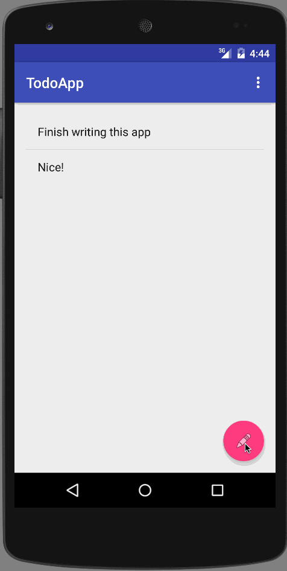

# TodoApp

This Android application is built for basic familiarity with Android and its development 
environment.

Time spent: Around 8 hours in total (including setting up the requirement)

Completed user stories:
 * [x] Required: Can you successfully add and remove items from the todo list within your app?
 * [x] Required: Did you include support for editing todo items as described above?
 * [x] Required: Does your app persist todo items and retrieve them properly on app restart?
 * [x] Required: Did you successfully push your code to github? Can you see the code on github?
 * [ ] Required: Did you add a README which includes a GIF walkthrough of the app's functionality?
 * [ ] Required: Did you create an issue on the repo and include /cc @codepathreview @codepath in the issue body?

Notes:
Added an "add task" feature that uses a FloatingActionButton
Added an undo feature for create/edit using the Snackbar.

Walkthrough of all user stories:

GIF created with [LiceCap](http://www.cockos.com/licecap/).
